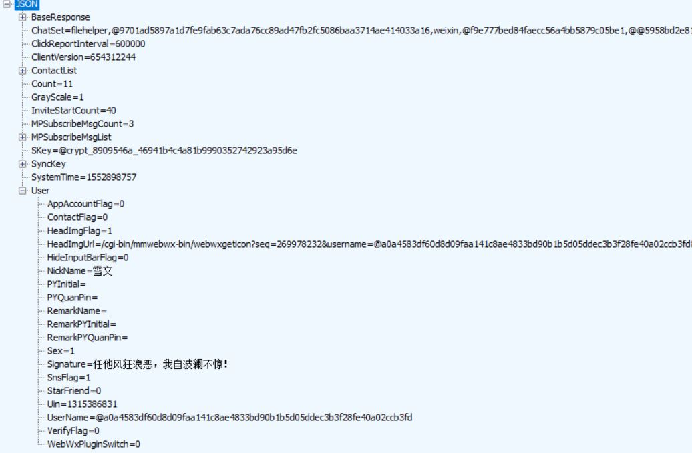

# 微信登陆测试

## 微信Web版登陆

```
getUUid:
    Request:
        GET:https://login.wx.qq.com/jslogin?appid=wx782c26e4c19acffb&redirect_uri=https%3A%2F%2Fwx.qq.com%2Fcgi-bin%2Fmmwebwx-bin%2Fwebwxnewloginpage&fun=new&lang=en_US&_=1552898738273

        https://wx.qq.com/cgi-bin/mmwebwx-bin/webwxnewloginpage

    Response：
        window.QRLogin.code = 200; window.QRLogin.uuid = "AYZr_4mkgA==";

getQRCode:
    Request:
        GET:https://login.weixin.qq.com/qrcode/AYZr_4mkgA==
        Accept: image/webp,image/apng,image/*,*/*;q=0.8
    Response:
        image/jpeg


getAvatar: # can be abandon
    Request:
        GET:https://login.wx.qq.com/cgi-bin/mmwebwx-bin/login?loginicon=true&uuid=AYZr_4mkgA==&tip=1&r=1879422556&_=1552898738274
    Response(Base64/jpg):
        window.code=201;window.userAvatar = 'data:img/jpg;base64,/9j/4AAQSkZJRgABAQAAAQABAAD/2wBDAAoHBwgHBgoICAgLCgoLDhgQDg0NDh0VFhEYIx8lJCIfIiEmKzcvJik0KSEiMEExNDk7Pj4...'

Redict:
    Request:
        GET:https://login.wx.qq.com/cgi-bin/mmwebwx-bin/login?loginicon=true&uuid=AYZr_4mkgA==&tip=0&r=1879407285&_=1552898738275

    Response:
        window.code=200;
        window.redirect_uri="https://wx2.qq.com/cgi-bin/mmwebwx-bin/webwxnewloginpage?ticket=AzgSofAr-XsPlczMqwxk--VF@qrticket_0&uuid=AYZr_4mkgA==&lang=en_US&scan=1552898753";

    okokok....

    Request:
        GET:https://wx2.qq.com/cgi-bin/mmwebwx-bin/webwxnewloginpage?ticket=AzgSofAr-XsPlczMqwxk--VF@qrticket_0&uuid=AYZr_4mkgA==&lang=en_US&scan=1552898753
        Accept: text/html,application/xhtml+xml,application/xml;q=0.9,image/webp,image/apng,*/*;q=0.8
    Response:
        Content-Type: text/plain;charset=utf-8
        Location: /
        body:
            <error>
              <ret>0</ret>  <!-- 登陆成功 -->
              <message></message>
              <skey>@crypt_8909546a_46941b4c4a81b9990352742923a95d6e</skey>
              <wxsid>qxzWpKTO0HshEqA2</wxsid>
              <wxuin>1315386831</wxuin>
              <pass_ticket>9WJosLmvybwrCeY1oj4%2FGdhZ0atJ%2F0mlew9rG6krsv4IgyCB0k%2BT2wW0T0ziMHXm</pass_ticket>
              <isgrayscale>1</isgrayscale>
            </error>

GET:https://wx2.qq.com/  ok
```
Redict获取信息 skey, uin, sid, pass_ticket

### webwxinit
```
Request:
    POST:https://wx2.qq.com/cgi-bin/mmwebwx-bin/webwxinit?r=1879404558
    Content-Type: application/json;charset=UTF-8
    Accept: application/json, text/plain, */*

    {"BaseRequest":{"Uin":"1315386831","Sid":"qxzWpKTO0HshEqA2","Skey":"","DeviceID":"e554083020314431"}}
    <!-- 此处skey并未使用 -->
Response:
    SKey=@crypt_8909546a_46941b4c4a81b9990352742923a95d6e
    SyncKey[{}]<!--length:4 -->
    SystemTime=1552898757
```



## 获取好友信息

```
Request:
    GET:https://wx2.qq.com/cgi-bin/mmwebwx-bin/webwxgetcontact?r=1552898757457&seq=0&skey=@crypt_8909546a_46941b4c4a81b9990352742923a95d6e
    Accept: application/json, text/plain, */*
Response:
    MemberList[{
        Alias=  <!-- 一般空-->
        City=Changchun
        HeadImgUrl=/cgi-bin/mmwebwx-bin/webwxgeticon....
        Province=Jilin
        NickName=XXX<!-- 微信名 -->
        PYInitial=OT
        RemarkName=XXX<!-- 备注名 -->
        RemarkPYInitial=XXX
        Sex=1<!-- 1:male 2:female -->
        Signature=每一天都过得充实
        UserName=@189b591df209da40dc246f28f353b30ba1092c6e85ae782f66971cda777108d1<!--  important -->
      }]
```


## 退出

```
Request:
    POST:https://wx2.qq.com/cgi-bin/mmwebwx-bin/webwxlogout?redirect=1&type=0&skey=%40crypt_8909546a_4fa03d01203621ca2d1af4af2c3341d8
    Content-Type: application/json;charset=UTF-8
    sid=qxzWpKTO0HshEqA2&uin=1315386831

    ...
```
-----

## 待实现
>数据retcode, selector含义， synccheck与webwxsync具体流程

### 发送信息

#### 请求Request
```
url: https://wx2.qq.com/cgi-bin/mmwebwx-bin/webwxsendmsg
Content-Type: application/json;charset=UTF-8
Accept: application/json, text/plain, */*

{"BaseRequest":{"Uin":1315386831,"Sid":"/qHtVtxRL4PjQvDJ","Skey":"@crypt_8909546a_ba9185547580a0c294af9cce78f07881","DeviceID":"e972150959544764"},"Msg":{"Type":1,"Content":"。。。","FromUserName":"@2f81775f3404437f23e71fae3756b180e24225d19e85d909e0de972556f3d7e1","ToUserName":"@e88e9f3cce402c61a98886d2392b5c6ca535b10712758cbf1fb31782b50a79c7","LocalID":"15535108515590675","ClientMsgId":"15535108515590675"},"Scene":0}
```


#### 接收Response
```
{
"BaseResponse": {
"Ret": 0,<!-- ok -->
"ErrMsg": ""
}
,
"MsgID": "6230832894280016364",
"LocalID": "15535109122050799"
}
```

### 接收信息

#### 请求Request
```
url: https://wx2.qq.com/cgi-bin/mmwebwx-bin/webwxsync?sid=/qHtVtxRL4PjQvDJ&skey=@crypt_8909546a_ba9185547580a0c294af9cce78f07881
Content-Type: application/json;charset=UTF-8
Accept: application/json, text/plain, */*

{"BaseRequest":{"Uin":1315386831,"Sid":"/qHtVtxRL4PjQvDJ","Skey":"@crypt_8909546a_ba9185547580a0c294af9cce78f07881","DeviceID":"e591515982793638"},"SyncKey":{"Count":9,"List":[{"Key":1,"Val":682759946},{"Key":2,"Val":682759984},{"Key":3,"Val":682759911},{"Key":11,"Val":682759920},{"Key":201,"Val":1553510740},{"Key":203,"Val":1553506124},{"Key":1000,"Val":1553502603},{"Key":1001,"Val":1553502675},{"Key":2001,"Val":1553155113}]},"rr":1267162753}
```
#### 接收Response
```
AddMsgList[{
  Content=@9efd782f25a4f768a07501011dc4004af2770f138c8541c6465e3ebc92422f93:<br/>19:00停电 发错了
  FromUserName=@@251c1eece9e003ddab557183cc579609adf5a540ce89b203bc6e41d757675e2e
  ToUserName=@2f81775f3404437f23e71fae3756b180e24225d19e85d909e0de972556f3d7e1
  MsgId=1858238095147766293
  MsgType=1
  }]
Skey
SyncCheckKey
SyncKey
```


### synccheck

```
Request:
    GET:https://webpush.wx2.qq.com/cgi-bin/mmwebwx-bin/synccheck?r=1553510963041&skey=%40crypt_8909546a_ba9185547580a0c294af9cce78f07881&sid=%2FqHtVtxRL4PjQvDJ&uin=1315386831&deviceid=e953395998828511&synckey=1_682759946%7C2_682759984%7C3_682759911%7C11_682759920%7C201_1553510740%7C203_1553506124%7C1000_1553502603%7C1001_1553502675%7C2001_1553155113&_=1553510735048

Response:
    window.synccheck={retcode:"0",selector:"0"}
```


# Other
>图灵机器人消息应答

[图灵机器人接入](https://guanyuespace.github.io/2019/05/13/TuRing_Robot/)
