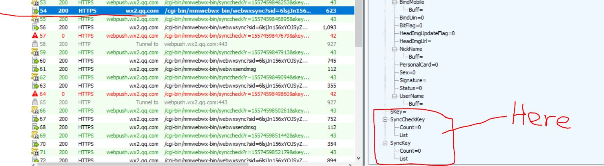

# Exception
> 网络请求webwxsync[POST], synccheck[GET]

## WebWxSync
>此请求用于获取【接收信息】，【synckey】

此请求数据异常：`synckey` 数据为空，需要忽略此次请求对 `synckey` 的影响


```java
Set syncKey=SyncKey{Count=0, List=[]}  //////////////////////////why this ??? ???
```

异常原因：？？？

### fiddler请求



## SyncCheck
>根据该请求返回结果{retcode,selector}用于判断当前所处状态

### 异常原因：

#### 1. `synckey`为空导致   
```java
Set syncKey=SyncKey{Count=0, List=[]}  //////////////////////////why this ??? ???

信息: https://wx2.qq.com/cgi-bin/mmwebwx-bin/webwxsync?sid=DDYHgm0CXQNH2NX1&skey=@crypt_8909546a_ecc2666825ac52f4600d46a3fb9778b4	HTTP/1.1 200 OK
五月 10, 2019 10:46:01 上午 util.MyHttpClient doPost
信息: Cookie:mm_lang=zh_CN;mm_lang=zh_CN;webwx_auth_ticket=CIsBELnpwYgNGoABJfx8EDwyNhK/HKkTNhtcgwrBfJg7RVbGQpxPmQvJU4w8aq5bd+pnqfme9VCHfeRXeV1CoVnx2RScrfXOM4eIGmoFIskUX8WQg5m5tSEQxHCUSklDYAV7ozJ0g9b/IjglK9ahboxnqfGj0b7LJYmuhT35Oq6I+ZT+8Esf1/zwyis=;webwx_data_ticket=gSdoTrnu679JgpLjj4kN/tAp;webwxuvid=80accb219ffb25535b8dd2c9857332da3f95a9544685241d5e632888a8c36a585a5e3fcf0ff100449138722f3ba4a601;wxloadtime=1557456345_expired;wxpluginkey=1557445519;wxsid=DDYHgm0CXQNH2NX1;wxuin=1315386831;
五月 10, 2019 10:46:02 上午 service.MessageTools syncCheck
信息: EXCEPTION-RES:
五月 10, 2019 10:46:02 上午 service.MessageTools syncCheck
信息: EXCEPTION-URL:
Exception in thread "Thread-1" java.lang.StringIndexOutOfBoundsException: String index out of range: -1/////由于synckey 数据异常导致
	at java.lang.AbstractStringBuilder.substring(AbstractStringBuilder.java:935)
	at java.lang.StringBuilder.substring(StringBuilder.java:76)
	at info.base.InitInfo.getSyncKeyStr(InitInfo.java:37)
	at service.MessageTools.syncCheck(MessageTools.java:109)
	at service.MessageTools.lambda$start$0(MessageTools.java:28)
	at java.lang.Thread.run(Thread.java:748)

Process finished with exit code 0
```


#### 2. 不明... ...

```java
Exception: https://webpush.wx2.qq.com/cgi-bin/mmwebwx-bin/synccheck?r=1557411230923&skey=@crypt_8909546a_f15d9defbdf2e10801ca773c68330eba&sid=A4TUMqe/pu4XBvbC&uin=1315386831&deviceid=e485374168903498&synckey=1_682765550%7C2_682766515%7C3_682766468%7C11_682766227%7C201_1557411227%7C1000_1557390799%7C1001_1557390803&_=1557411208458
org.apache.http.client.ClientProtocolException
	at org.apache.http.impl.client.InternalHttpClient.doExecute(InternalHttpClient.java:187)
	at org.apache.http.impl.client.CloseableHttpClient.execute(CloseableHttpClient.java:83)
	at org.apache.http.impl.client.CloseableHttpClient.execute(CloseableHttpClient.java:108)
	at org.apache.http.impl.client.CloseableHttpClient.execute(CloseableHttpClient.java:56)
	at util.MyHttpClient.doGet(MyHttpClient.java:69)
	at service.MessageTools.syncCheck(MessageTools.java:96)
	at service.MessageTools.lambda$start$0(MessageTools.java:25)
	at java.lang.Thread.run(Thread.java:748)
Caused by: org.apache.http.ProtocolException: Invalid response: HTTP/1.1 0 -
	at org.apache.http.protocol.HttpRequestExecutor.doReceiveResponse(HttpRequestExecutor.java:276)
	at org.apache.http.protocol.HttpRequestExecutor.execute(HttpRequestExecutor.java:125)
	at org.apache.http.impl.execchain.MainClientExec.execute(MainClientExec.java:272)
	at org.apache.http.impl.execchain.ProtocolExec.execute(ProtocolExec.java:185)
	at org.apache.http.impl.execchain.RetryExec.execute(RetryExec.java:89)
	at org.apache.http.impl.execchain.RedirectExec.execute(RedirectExec.java:110)
	at org.apache.http.impl.client.InternalHttpClient.doExecute(InternalHttpClient.java:185)
	... 7 more
```


<p style="color:red; font:bold 18px arial;">Invalid response: HTTP/1.1 0 -</p>

syncKey存在且正常... ...
如下图：

